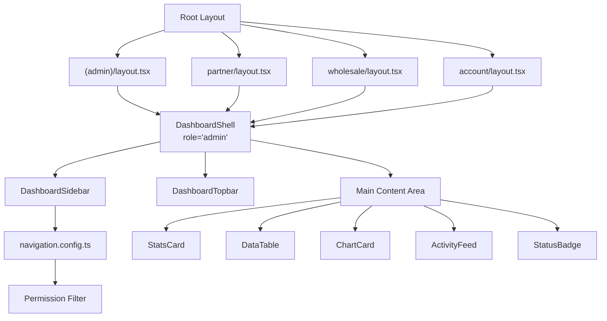

# Unified Admin Dashboard System — Implementation Plan

## Background & Problem

The current codebase has **4 separate shell implementations** (AdminShell, PartnerShell, WholesaleShell, AccountShell) with duplicated sidebars, topbars, and UI patterns. Each role uses a different color theme (amber, teal, blue, rose) and different background colors, violating the user's requirement for **full visual consistency** across all dashboards.

Additionally, dashboard pages use raw HTML elements instead of a proper component library — no shadcn/ui primitives, no data tables with sorting/filtering/pagination, no charts, and no standard Dialog/Sheet patterns for actions.

## Skills Applied

| Skill | Application |
|-------|------------|
| `shadcn` | shadcn/ui component installation, composition rules, semantic colors |
| `kpi-dashboard-design` | KPI card patterns, dashboard hierarchy (4-6 headline KPIs + trends) |
| `react-best-practices` | Component memoization, parallel data fetching, dynamic imports |
| `nextjs-app-router-patterns` | App Router layouts, "use client" directives, route grouping |
| `tailwind-design-system` | Design token unification, semantic colors over raw values |
| `architecture-patterns` | Unified shell pattern, role-permission-based rendering |

## User Review Required

> [!IMPORTANT]
> **Single Accent Color Decision**: The plan unifies all dashboards under a **single amber gold** (`#D4AF37`) accent, matching the frontend's luxury gold. This eliminates the per-role theming (teal/blue/rose). If you prefer to keep subtle role-based accent hints, please let me know.

> [!WARNING]
> **shadcn/ui Installation**: This will add `@radix-ui/*` peer dependencies and create a `components.json` config. The project currently uses Tailwind v4 and Next.js 16 — I'll ensure compatibility during init.

> [!IMPORTANT]
> **Recharts vs Tremor**: For charts, I'll use **Recharts** (shadcn/ui's Chart component wraps Recharts). This adds ~45KB gzipped to the bundle but provides line/bar/area/pie charts. Confirm this is acceptable.

---

## Proposed Changes

### Phase 1: Foundation — shadcn/ui Setup & Design Tokens

#### [MODIFY] [package.json](file:///d:/Ashish%20Projects/In%20Use/e-commerce-next.js/frontend/package.json)
- Install shadcn/ui and required dependencies:
  - `recharts` for charts
  - `sonner` for toast notifications
  - `@radix-ui/react-*` primitives (installed via shadcn CLI)

#### [NEW] [components.json](file:///d:/Ashish%20Projects/In%20Use/e-commerce-next.js/frontend/components.json)
- shadcn/ui configuration pointing to existing Tailwind v4 setup
- Register component aliases: `@/components/ui`

#### [MODIFY] [globals.css](file:///d:/Ashish%20Projects/In%20Use/e-commerce-next.js/frontend/src/app/globals.css)
- Add unified dashboard design tokens:
  - `--dashboard-bg: #f5f4f0` (soft neutral per user spec)
  - `--dashboard-card: #ffffff`
  - `--dashboard-border: #e8e5e0`
  - `--dashboard-sidebar: #1c1c1c`
  - `--dashboard-accent: #D4AF37` (luxury gold)
  - `--dashboard-accent-muted: rgba(212,175,55,0.1)`
- Update `@theme inline` block for dashboard semantic colors
- Add dashboard-specific animations (card hover lift, skeleton shimmer)

---

### Phase 2: shadcn/ui Component Installation

Install these shadcn/ui primitives via CLI:

```bash
npx shadcn@latest add card badge separator skeleton tabs
npx shadcn@latest add dialog sheet dropdown-menu
npx shadcn@latest add table input select button
npx shadcn@latest add tooltip avatar scroll-area
npx shadcn@latest add chart     # Recharts wrapper
npx shadcn@latest add sonner    # Toast
```

Each added component will be verified and imports fixed post-installation.

---

### Phase 3: Unified Dashboard Shell

> Replace 4 duplicated shell implementations with ONE configurable shell.

#### [NEW] [DashboardShell.tsx](file:///d:/Ashish%20Projects/In%20Use/e-commerce-next.js/frontend/src/components/dashboard/DashboardShell.tsx)
- Accepts `role` prop to determine nav items and branding text
- Unified sidebar: dark `#1c1c1c` background, amber accent for all roles
- Unified topbar: search, notifications, profile badge
- Error boundary wrapping
- Responsive: collapsible sidebar, mobile overlay
- Auth guard with branded loading state

#### [NEW] [DashboardSidebar.tsx](file:///d:/Ashish%20Projects/In%20Use/e-commerce-next.js/frontend/src/components/dashboard/DashboardSidebar.tsx)
- Single sidebar component with permission-filtered navigation
- Role-based nav items config:

| Role | Nav Items |
|------|----------|
| Super Admin | Dashboard, Diamonds, Products, Orders, Users, Settings, Page Builder |
| Admin | Dashboard, Diamonds, Products, Orders |
| Partner | Dashboard, My Diamonds, My Orders, Profile |
| Wholesale | Dashboard, Orders, Bulk Quote, Profile |
| Retail | Dashboard, Orders, Wishlist, Profile |

- Collapse/expand with icon-only mode
- Active route highlighting with amber accent
- Logo: "OmGems" + role badge

#### [NEW] [DashboardTopbar.tsx](file:///d:/Ashish%20Projects/In%20Use/e-commerce-next.js/frontend/src/components/dashboard/DashboardTopbar.tsx)
- Unified top bar: search input, notification bell, profile dropdown
- User name and role badge display
- Mobile sidebar toggle

#### [NEW] [navigation.config.ts](file:///d:/Ashish%20Projects/In%20Use/e-commerce-next.js/frontend/src/components/dashboard/navigation.config.ts)
- Centralized navigation config mapping roles to nav items
- Each item: `{ name, href, icon, permission? }`
- Used by DashboardSidebar to render permission-filtered navigation

---

### Phase 4: Reusable Dashboard Components

#### [NEW] [StatsCard.tsx](file:///d:/Ashish%20Projects/In%20Use/e-commerce-next.js/frontend/src/components/dashboard/StatsCard.tsx)
- Built on shadcn `Card` primitive
- Props: `title`, `value`, `icon`, `trend`, `trendDirection`, `subtitle`
- Hover state: subtle lift + shadow
- Trend indicator: green up arrow / red down arrow
- Loading skeleton variant

#### [NEW] [DataTable.tsx](file:///d:/Ashish%20Projects/In%20Use/e-commerce-next.js/frontend/src/components/dashboard/DataTable.tsx)
- Built on shadcn `Table` + custom hooks
- Features: column sorting, text filtering, pagination (configurable page size)
- Row actions via shadcn `DropdownMenu`
- Empty state with `EmptyState` component
- Loading state with `Skeleton` rows
- Fully generic — accepts column definitions and data array

#### [NEW] [ChartCard.tsx](file:///d:/Ashish%20Projects/In%20Use/e-commerce-next.js/frontend/src/components/dashboard/ChartCard.tsx)
- Wrapper around shadcn `Chart` (Recharts)
- Supports: Line, Bar, Area, Pie chart types
- Consistent styling: amber/gold color palette
- Responsive container

#### [NEW] [ActivityFeed.tsx](file:///d:/Ashish%20Projects/In%20Use/e-commerce-next.js/frontend/src/components/dashboard/ActivityFeed.tsx)
- Reusable activity list with icon + description + timestamp
- Built on shadcn `Card` + `ScrollArea`
- Empty state handling

#### [NEW] [StatusBadge.tsx](file:///d:/Ashish%20Projects/In%20Use/e-commerce-next.js/frontend/src/components/dashboard/StatusBadge.tsx)
- Built on shadcn `Badge` with semantic status variants
- Variants: `success`, `warning`, `error`, `info`, `neutral`
- Used across all data tables for order/diamond status

#### [NEW] [DashboardSkeleton.tsx](file:///d:/Ashish%20Projects/In%20Use/e-commerce-next.js/frontend/src/components/dashboard/DashboardSkeleton.tsx)
- Full-page loading skeleton for dashboard initial load
- Stats cards skeleton row + table skeleton + chart skeleton

---

### Phase 5: Role Dashboard Pages (Unified Design)

#### [MODIFY] [admin/page.tsx](file:///d:/Ashish%20Projects/In%20Use/e-commerce-next.js/frontend/src/app/(admin)/admin/page.tsx)
- Rewrite using `StatsCard`, `ChartCard`, `ActivityFeed`, `DataTable`
- KPIs: Total Users, Total Diamonds, Total Orders, Total Revenue
- Charts: Revenue trend (line), Orders by status (bar)
- Recent Activity feed
- Quick actions section

#### [MODIFY] [partner/dashboard/page.tsx](file:///d:/Ashish%20Projects/In%20Use/e-commerce-next.js/frontend/src/app/partner/dashboard/page.tsx)
- Same component layout, different data
- KPIs: Active Listings, Pending Orders, Revenue, Inventory Value
- Charts: Sales trend, Diamond status breakdown

#### [MODIFY] [wholesale/dashboard/page.tsx](file:///d:/Ashish%20Projects/In%20Use/e-commerce-next.js/frontend/src/app/wholesale/dashboard/page.tsx)
- KPIs: Total Orders, Total Spent, Active Quotes, Credit Utilization
- Credit utilization bar
- Recent orders table

#### [MODIFY] [account/page.tsx](file:///d:/Ashish%20Projects/In%20Use/e-commerce-next.js/frontend/src/app/account/page.tsx)
- KPIs: Total Orders, Pending Orders, Total Spent, Wishlist Items
- Recent orders list with status badges

---

### Phase 6: Layout Rewiring

#### [MODIFY] [(admin)/layout.tsx](file:///d:/Ashish%20Projects/In%20Use/e-commerce-next.js/frontend/src/app/(admin)/layout.tsx)
- Replace `AdminShell` with `DashboardShell role="admin"`

#### [MODIFY] [partner/layout.tsx](file:///d:/Ashish%20Projects/In%20Use/e-commerce-next.js/frontend/src/app/partner/layout.tsx)
- Replace `PartnerShell` with `DashboardShell role="partner"`

#### [MODIFY] [wholesale/layout.tsx](file:///d:/Ashish%20Projects/In%20Use/e-commerce-next.js/frontend/src/app/wholesale/layout.tsx)
- Replace `WholesaleShell` with `DashboardShell role="wholesale"`

#### [MODIFY] [account/layout.tsx](file:///d:/Ashish%20Projects/In%20Use/e-commerce-next.js/frontend/src/app/account/layout.tsx)
- Replace `AccountShell` with `DashboardShell role="retail"`

---

### Phase 7: Toast & Dialog Integration

#### [MODIFY] [layout.tsx](file:///d:/Ashish%20Projects/In%20Use/e-commerce-next.js/frontend/src/app/layout.tsx)
- Add `<Toaster />` from sonner for global toast notifications

#### Usage pattern for all dashboard forms:
```tsx
import { toast } from "sonner";
// On success: toast.success("Diamond updated successfully")
// On error: toast.error("Failed to save changes")
```

---

## Architecture Diagram



---

## Open Questions

> [!IMPORTANT]
> 1. **Accent Color**: Should all dashboards use the luxury gold (#D4AF37), or should we keep subtle role-based color hints (amber for admin, teal for partner, etc.) within the KPI card icons only?

> [!IMPORTANT]
> 2. **Old Shell Components**: After migration, should I delete the old per-role shell/sidebar/topbar files (`AdminShell.tsx`, `PartnerShell.tsx`, etc.) or keep them as backups?

> [!NOTE]
> 3. **Charts Data**: The backend currently doesn't return chart-ready timeseries data. Should I add mock/dummy data for charts initially, or should I also create the needed backend endpoints?

---

## Verification Plan

### Automated Tests
- Run `npm run build` to verify zero TypeScript/build errors
- Verify all routes load without runtime crashes

### Browser Testing
- Navigate to each dashboard role (`/admin`, `/partner/dashboard`, `/wholesale/dashboard`, `/account`)
- Verify identical layout, spacing, and color palette across all roles
- Test sidebar collapse/expand behavior
- Test responsive layout at mobile breakpoints
- Verify search bar, notifications bell, and profile section render correctly
- Test loading skeleton states
- Verify toast notifications fire on actions

### Manual Verification
- Screenshot comparison of all 4 dashboards to confirm visual unity
- Compare dashboard background/card colors against frontend theme (#f5f4f0 background)
